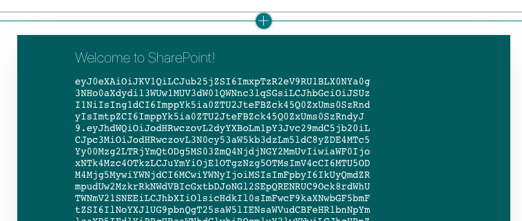

<!-- markdownlint-disable MD002 MD041 -->

SharePoint Framework では、Microsoft Graph にアクセスするためのアクセストークンを取得するために、Azure AD でアプリケーションを登録する必要がなくなります。 SharePoint にログインしているユーザーの認証を処理し、web パーツでユーザートークンを取得できるようにします。 Web パーツで必要な [グラフアクセス許可のスコープ](https://docs.microsoft.com/graph/permissions-reference) を指定する必要があり、テナント管理者はインストール中にこれらのアクセス許可を承認できます。

## <a name="configure-permissions"></a>アクセス許可を構成する

1. / **Config/package-solution.jsを** 開きます。

1. 次のコードをプロパティに追加し `solution` ます。

    ```json
    "webApiPermissionRequests": [
      {
        "resource": "Microsoft Graph",
        "scope": "Calendars.ReadWrite"
      },
      {
        "resource": "Microsoft Graph",
        "scope": "User.ReadBasic.All"
      },
      {
        "resource": "Microsoft Graph",
        "scope": "Contacts.Read"
      },
      {
        "resource": "Microsoft Graph",
        "scope": "People.Read"
      }
    ]
    ```

`Calendars.ReadWrite`アクセス許可によって、web パーツは、ユーザーの予定表を取得したり、Microsoft Graph を使用してイベントを追加したりできます。 その他のアクセス許可は、イベントの参加者と開催者に関する情報を表示するために、Microsoft Graph Toolkit のコンポーネントによって使用されます。

## <a name="optional-test-token-acquisition"></a>オプション: テストトークンの取得

> [!NOTE]
> このページの残りの手順はオプションです。 Microsoft Graph のコーディングをすぐに開始したい場合は、 [予定表ビューを取得](/graph/tutorials/spfx?tutorial-step=3)することができます。

トークンの取得をテストするために、いくつかの一時コードを web パーツに追加してみましょう。

1. **/Src/webparts/graphTutorial/GraphTutorialWebPart.ts** を開き、次の `import` ステートメントをファイルの先頭に追加します。

    ```typescript
    import { AadTokenProvider } from '@microsoft/sp-http';
    ```

1. 既存の `render` 関数を、以下の関数で置き換えます。

    ```typescript
    public render(): void {
    this.context.aadTokenProviderFactory
      .getTokenProvider()
      .then((provider: AadTokenProvider)=> {
      provider
        .getToken('https://graph.microsoft.com')
        .then((token: string) => {
          this.domElement.innerHTML = `
          <div class="${ styles.graphTutorial }">
            <div class="${ styles.container }">
              <div class="${ styles.row }">
                <div class="${ styles.column }">
                  <span class="${ styles.title }">Welcome to SharePoint!</span>
                  <p><code style="word-break: break-all;">${ token }</code></p>
                </div>
              </div>
            </div>
          </div>`;
        });
      });
    }
    ```

### <a name="deploy-the-web-part"></a>Web パーツを展開する

1. Web パーツをビルドしてパッケージ化するには、CLI で次の2つのコマンドを実行します。

    ```Shell
    gulp bundle --ship
    gulp package-solution --ship
    ```

1. ブラウザーを開き、テナントの SharePoint アプリカタログに移動します。 左側の [ **SharePoint 用アプリ** ] メニュー項目を選択します。

1. **/Sharepoint/solution/graph-tutorial.sppkg** ファイルをアップロードします。

1. [ **信頼する..** .] プロンプトに、[ファイルの **package-solution.js** に設定した4つの Microsoft Graph アクセス許可が一覧表示されていることを確認します。 [ **組織内のすべてのサイトでこのソリューションを使用できるようにする** ] を選択し、[ **展開** ] を選択します。

1. テナント管理者を使用して [SharePoint 管理センター](https://admin.microsoft.com/sharepoint?page=classicfeatures&modern=true) に移動します。

1. 左側のメニューで、[ **詳細** ]、[ **API アクセス** ] の順に選択します。

1. **グラフ-チュートリアル-クライアント側ソリューション** パッケージから保留中の各要求を選択し、[ **承認** ] を選択します。

    

### <a name="test-the-web-part"></a>Web パーツをテストする

1. Web パーツをテストする SharePoint サイトに移動します。 Web パーツをテストする新しいページを作成します。

1. Web パーツピッカーを使用して、 **Graphtutorial** web パーツを検索し、それをページに追加します。

    

1. アクセストークンは、「 **SharePoint へようこそ!** 」の下に印刷されます。 web パーツ内のメッセージ。 このトークンをコピーして解析することで、 [https://jwt.ms/](https://jwt.ms/) web パーツに必要なアクセス許可のスコープが含まれていることを確認できます。

    
