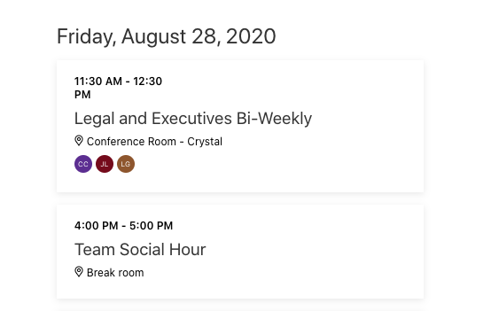

<!-- markdownlint-disable MD002 MD041 -->

このセクションでは、web パーツを更新して、ユーザーがチームの週のソーシャル時間の予定表にイベントを追加できるようにします。In this section you'll update the web part to allow the user to add an event to their calendar for the team's weekly social hour. このシナリオでは、チームは金曜日の午後4時に1週間のソーシャル時間を持ちます。In this scenario, the team has a weekly social hour at 4 PM on Friday.

1. **/Src/webparts/graphTutorial/GraphTutorialWebPart.ts** を開き、既存の `addSocialToCalendar()` メソッドを次のように置き換えます。Open **./src/webparts/graphTutorial/GraphTutorialWebPart.ts** and replace the existing `addSocialToCalendar()` method with the following.

    :::code language="typescript" source="../demo/graph-tutorial/src/webparts/graphTutorial/GraphTutorialWebPart.ts" id="addSocialToCalendarSnippet":::

    このコードの内容を検討してください。Consider what this code does.

    - 今後の次の金曜日を調べ、その日の午後4時に **日付** を作成します。It determines the next upcoming Friday and constructs a **Date** for 4 PM on that day.
    - このメソッドは、新しい **Microsoft graph の Event** オブジェクトを作成し、 **日付** の値に開始を設定し、1時間後に終了します。It constructs a new **MicrosoftGraph.Event** object, setting the start to the value of the **Date** , and the end for one hour later.
    - **Msgraphclient** を使用して、エンドポイントに新しいイベントをポストし `/me/events` ます。It uses the **MSGraphClient** to POST the new event to the `/me/events` endpoint.
    - これにより、新しいイベントによってビューが更新されるように、web パーツが再レンダリングされます。It re-renders the web part so the view is updated with the new event.

1. Web パーツをビルド、パッケージ化、再アップロードし、テストするページを更新します。Build, package, and re-upload the web part, then refresh the page where you are testing it.

1. [ **チームソーシャルの追加** ] ボタンをクリックします。Click the **Add team social** button. ページが更新されたら、金曜日までスクロールし、新しいイベントを見つけます。Once the page refreshes, scroll down to Friday and find the new event.

    
